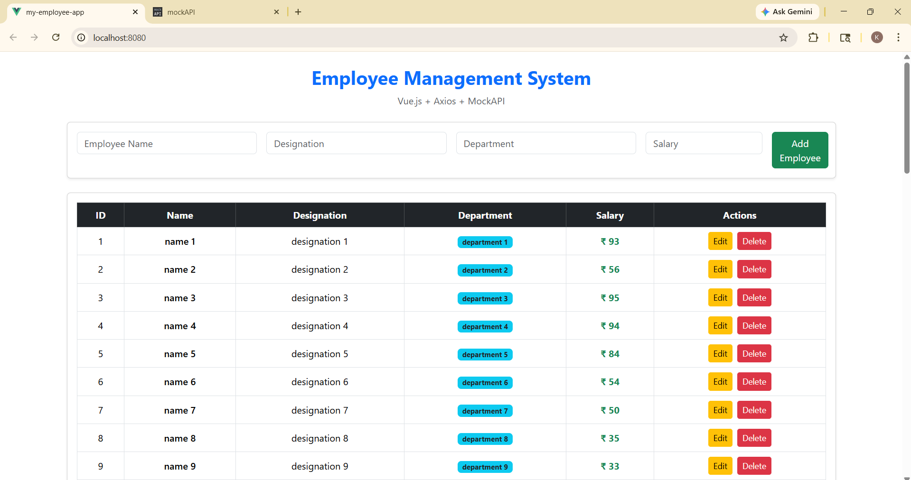
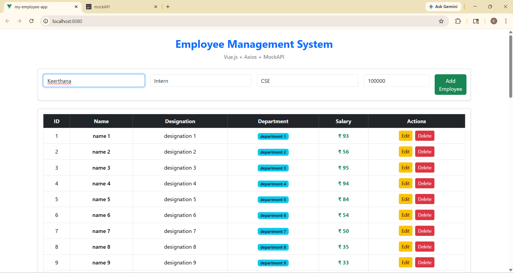
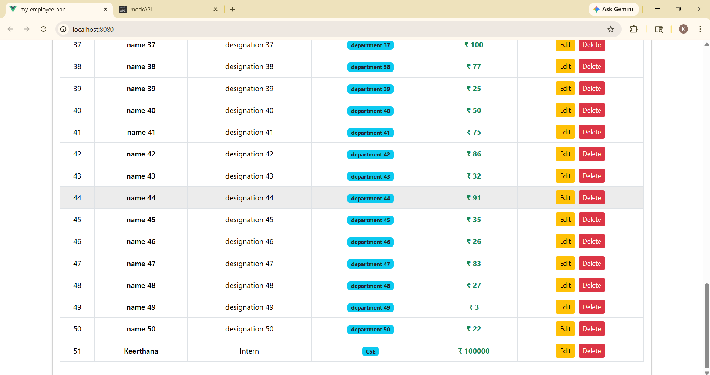
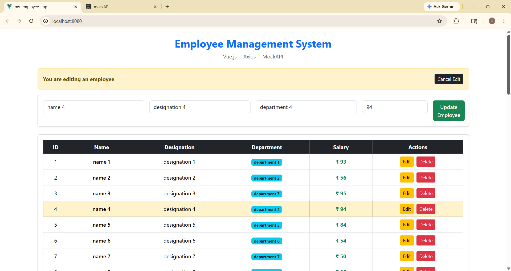
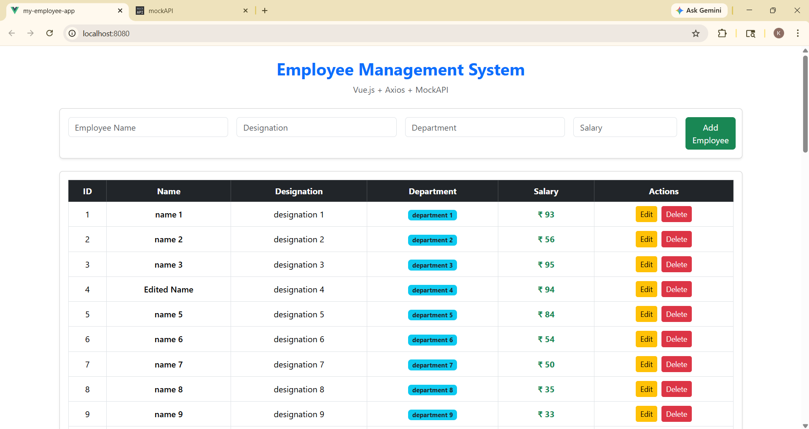

#  Employee Management System

A modern **Employee Management Web Application** built using **Vue.js, Axios, and MockAPI**.
This project performs full **CRUD operations** with a clean and responsive UI using Bootstrap.


## Overview

This application allows users to manage employee records efficiently. It interacts with a REST API (MockAPI) to store and retrieve data dynamically.


##  Features

*  Add new employee
*  View all employees
*  Edit employee details (with clear edit mode UI)
*  Delete employee
*  Real-time API integration using Axios
*  Responsive and clean UI using Bootstrap


##  Employee Data Fields

* Employee ID *(Auto-generated)*
* Name
* Designation
* Department
* Salary

---

##  Tech Stack

* **Frontend:** Vue.js (Vue CLI)
* **API Handling:** Axios
* **Backend (Mock):** MockAPI
* **Styling:** Bootstrap
* **Version Control:** Git & GitHub


## Installation & Setup

1. Clone the repository:

```bash
git clone https://github.com/YOUR_USERNAME/my-employee-app.git
```

2. Navigate into the project:

```bash
cd my-employee-app
```

3. Install dependencies:

```bash
npm install
```

4. Run the application:

```bash
npm run serve
```

5. Open in browser:


## Deployment

This project can be deployed using:

* GitHub Pages
* Netlify
* Vercel

### GitHub Pages:

```bash
npm run build
npm run deploy
```


##  Screenshots

###  Home Page
Displays all employees in a table with details like name, designation, department, and salary.



###  Add Employee
User can enter employee details using the form and add a new record.

 

###  Edit Mode
When the edit button is clicked, the form is filled and edit mode is clearly indicated.



###  Delete Employee
User can delete an employee record using the delete button.


---

## Concepts Used

* Vue.js Components
* Two-way Data Binding (`v-model`)
* Event Handling (`@click`)
* Conditional Rendering (`v-if`)
* List Rendering (`v-for`)
* Axios API Calls
* CRUD Operations
* Bootstrap Grid System

---

## Learning Outcomes

* Built a dynamic web application using Vue.js
* Integrated REST API using Axios
* Implemented CRUD functionality
* Designed responsive UI using Bootstrap
* Learned deployment using GitHub

---

## Academic Mapping

* **CO4:** Develop dynamic web applications using modern frameworks
* **CO5:** Integrate frontend applications with APIs

---

## Acknowledgement

This project was developed as part of a Web Programming Lab to demonstrate practical implementation of Vue.js and API integration.

---

## Author

**Keerthana R**
Computer Science Student

---

## Support

If you found this project useful, consider giving it a ⭐ on GitHub!

---


# my-employee-app

## Project setup
```
npm install
```

### Compiles and hot-reloads for development
```
npm run serve
```

### Compiles and minifies for production
```
npm run build
```

### Lints and fixes files
```
npm run lint
```

### Customize configuration
See [Configuration Reference](https://cli.vuejs.org/config/).
